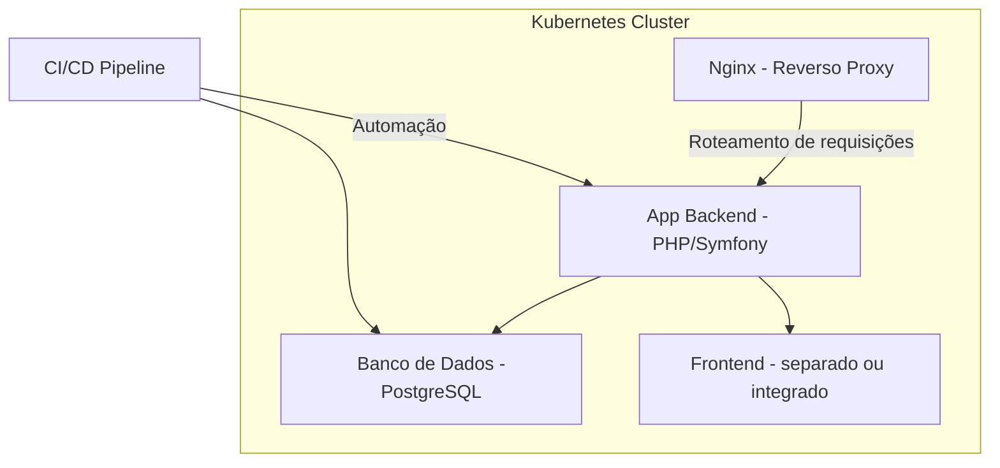

# Sistema de Pedidos

Este repositório contém o sistema de pedidos implementado utilizando Symfony e um banco de dados PostgreSQL, sendo executado dentro de um cluster Kubernetes. O sistema é acessado via Nginx, com a aplicação PHP-FPM sendo executada em um contêiner separado.

## Pré-requisitos

Antes de começar, verifique se você tem os seguintes pré-requisitos instalados:

- [Docker](https://www.docker.com/)
- [Kubernetes (kubectl)](https://kubernetes.io/docs/tasks/tools/)
- [Helm](https://helm.sh/) (se necessário para a instalação de dependências adicionais)

## Subindo o Kubernetes

### 1. Subir o cluster Kubernetes (local ou em nuvem)

Se você estiver usando o [Minikube](https://minikube.sigs.k8s.io/docs/) para um ambiente local, execute o seguinte comando para iniciar o Minikube:

```bash
minikube start
```
Caso esteja usando um cluster Kubernetes em nuvem (como AWS EKS, GCP GKE, ou Azure AKS), siga a documentação específica do provedor de nuvem para configurar o kubectl.

### 2. Verifique se o cluster está em funcionamento
Execute o comando abaixo para verificar se o cluster está ativo e os pods estão sendo executados:

```bash
kubectl get pods
```

### 3. Subir os arquivos da aplicação
Aplique os arquivos de configuração do Kubernetes para os deployments e services:

```bash
kubectl apply -f ./kubernetes/pvc.yaml \
              -f ./kubernetes/php-config.yaml \
              -f ./kubernetes/postgres-init-sql.yaml \
              -f ./kubernetes/postgres-deployment.yaml \
              -f ./kubernetes/postgres-service.yaml \
              -f ./kubernetes/app-deployment.yaml \
              -f ./kubernetes/app-service.yaml \
              -f ./kubernetes/hpa.yaml \
              -f ./kubernetes/nginx-deployment.yaml \
              -f ./kubernetes/nginx-service.yaml \
              -f ./kubernetes/nginx-configmap.yaml
```
Este comando cria os deployments para a aplicação e o banco de dados, além dos services para expor as portas necessárias.

Port-Forwarding
#### 1. Expondo a aplicação localmente
Após os serviços estarem configurados no Kubernetes, você pode acessar a aplicação utilizando kubectl port-forward.

Execute o seguinte comando para fazer o forward da porta 80 do serviço sistema-pedidos-nginx para sua máquina local (porta 8080):

```bash
kubectl port-forward svc/sistema-pedidos-nginx 8080:80
```
Isso permitirá que você acesse a aplicação no seu navegador através do endereço http://localhost:8080.

#### 2. Verifique se o port-forward foi configurado corretamente
Você pode verificar se o port-forward está funcionando corretamente acessando a aplicação no navegador. Se não for possível acessar, revise as etapas de configuração e logs para identificar possíveis erros.

## Estrutura do Kubernetes
### Deployments
sistema-pedidos-app: Contém o contêiner da aplicação Symfony rodando com PHP-FPM.
sistema-pedidos-nginx: Contém o Nginx configurado para servir a aplicação, com proxy reverso para o PHP-FPM.

### Services
database: Expondo a porta 5432 para o banco de dados PostgreSQL.
sistema-pedidos-nginx: Expondo a porta 80 através do NodePort para acesso externo ao Nginx.
sistema-pedidos-service: O serviço que conecta a aplicação ao banco de dados.

## Arquitetura
### 1. Requisitos do Negócio (Problema):
Sistema de Pedidos: Um sistema que permite realizar pedidos, com foco em microserviços e escalabilidade.
Tecnologias:
Backend: Processa os pedidos, interage com o banco de dados.
Banco de Dados: Armazena informações sobre pedidos, clientes, etc.
Nginx como Reverso Proxy: Para encaminhar as requisições para o backend.

### 2. Requisitos de Infraestrutura:
Kubernetes: Utilizando Kubernetes (Minikube ou em nuvem), para gerenciamento de containers e escalabilidade.
Ingress Controller: Para expor serviços externos através do Nginx.
Banco de Dados: Pode ser um serviço como PostgreSQL rodando dentro de Kubernetes ou em nuvem.
CI/CD: Pode ser configurado com pipelines (como GitLab CI ou Jenkins) para automação de deploy.

### 3. Desenho da Arquitetura:
#### Componentes:
#### 1. Nginx (Ingress Controller):
Serve como um proxy reverso para os microserviços.
Exposição do serviço via NodePort ou LoadBalancer.
#### 2. App Backend (PHP/Symfony):
Contém a lógica de negócios.
Está configurado com variáveis de ambiente para conectar ao banco de dados.
#### 3. Banco de Dados (PostgreSQL):
Armazena as informações de pedidos e usuários.
#### 4. Frontend (se aplicável):
Pode ser um container separado ou um serviço integrado ao backend.
#### 5. Pipeline CI/CD:
Automatiza o processo de build, testes e deploy.

### 4. Implementação:
#### a. Infraestrutura Kubernetes (usando Minikube ou outra plataforma):
Minikube pode ser utilizado em sua máquina local para criar um cluster Kubernetes. No caso de usar uma nuvem como GKE, AKS ou EKS, a configuração seria muito parecida.
#### b. Serviços:
Nginx:
Pode ser configurado como um Deployment no Kubernetes com um Service do tipo NodePort ou LoadBalancer.
#### c. Banco de Dados:
PostgreSQL:
Um serviço ClusterIP em Kubernetes para comunicação interna.
#### d. Deploy e CI/CD:
Pipeline:
Você pode usar o GitLab CI ou GitHub Actions para configurar o pipeline de CI/CD, para automatizar o deploy dos containers no Kubernetes.


